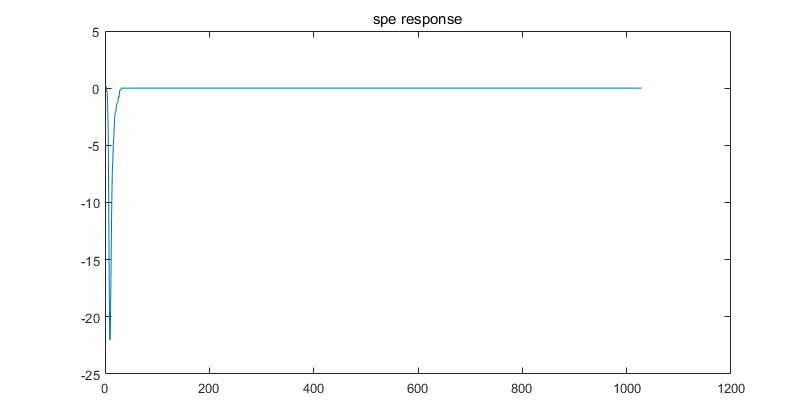

# PMT-waveform

Template for the final project of PMT-waveform in Physics Data course

提示：如果你无法渲染其中的公式，请阅读 `README.pdf`，两者内容相同。

## 大作业简介

PMT-waveform 这个作业基于中微子比赛延伸而来，目的希望让同学们了解在实验物理中模拟数据的产生过程以及模拟对于实验物理的指导作用。

作业中的所有输入数据和真实数据并不相同，但是可以基本表述真实的物理过程。在探测中微子过程中用到的重要的仪器就是光电倍增管(PMT)，当中微子和探测介质液体闪烁体发生作用后，会有对应数量(和中微子能量相关)的光子释放出来。当光子入射到PMT表面后，PMT会将光子的信号转化为电压信号，并将电压信号放大。具体的物理过程可以参考《核辐射物理及探测学》。

作业中涉及的数据均是这些电压信号，而光子产生的电压信号对于单个PMT来说可以基本认为不变，我们将其称为单光电子响应 $h(t)​$（如下图所示）；而不同时间入射的光子 $x(t)​$ （一系列的 $\delta​$ 函数）产生的电压信号会叠加在一起。整个过程可以视作一个线性时不变的系统，那么最后的波形 $y(t)​$ 由下式给出（其中 $*$ 表示卷积）：

$$
y(t)=x(t)*h(t)
$$

你的任务就是重复上述的物理过程，将输入的入射光子波形 $x(t)$ 转化成最后的波形。一个说明性的图示可见 `pipeline.pdf`。

## 数据说明

所有的输入数据存放在 `data` 文件夹下，因此请不要随意改动这个文件夹下的内容。

`SPE.h5` 中存放着单光电子响应 $h(t)$，`PE-info.h5` 中存放着入射光子的时间信息，即对应 $\delta$ 函数的时间。具体格式如下：

| EventID | ChannelID | PETime | Weight |
| ------- | --------- | ------ | ------ |
| 1       | 0         | 276    | 1      |
| 1       | 0         | 286    | 1      |
| 1       | 0         | 303    | 3      |
| 1       | 1         | 276    | 1      |
| 1       | 1         | 296    | 1      |
| 1       | 2         | 306    | 1      |
| ...     | ...       | ...    | ...    |
| 1       | 29        | 276    | 1      |
| 1       | 29        | 306    | 1      |
| ...     | ...       | ...    | ...    |
| ...     | ...       | ...    | ...    |
| 3       | 0         | 276    | 1      |
| 3       | 0         | 286    | 1      |
| 3       | 0         | 303    | 1      |
| 3       | 1         | 276    | 2      |
| 3       | 1         | 296    | 1      |
| 3       | 2         | 306    | 1      |
| ...     | ...       | ...    | ...    |
| 3       | 29        | 276    | 1      |
| 3       | 29        | 306    | 1      |

其中第一列是 `EventID` 记录事件数，第二列 `ChannelID` 记录通道数，每一个事件对应有 $N = 30​$ 个通道（PMT），因为实际探测过程中有 30 个PMT在工作，而每个PMT记录到的对应光子数实际上可能有多个。

你需要注意的问题是某个事件中，并不是所有 Channel 都有记录，所以某个事件中可能不足30个PMT 的 Channel。你不必计算那些没有记录的 Channel。

第三列 `PETime` 是光子入射时间，第四列 `Weight` 是权重，提供的样例数据中给出的权重是1，实际最后测试时使用的数据并不一定是1，可能是其它值。你需要将权重乘在单光电子响应 $h(t)​$ 上，得到该探测器上得到的实际响应。

比如对于第3个事件，第0个PMT上在 `PETime` 为 276，286，303 时上有光子入射进来，那么你需要把这三个光子产生的响应（分别成对应的权重后）叠加在一起，使用之前所说的卷积公式（实际上就是平移叠加），你就能够产生对应的波形了。

那么对于所有的 PMT (或者称之为 Channel )，依次进行上述的操作，你就可以得到所有 Channel 的理想波形了。 Good Luck!

对于实际物理问题通常会有噪声，此处我们假定基线存在的是高斯噪声，对应的高斯分布的 $\sigma$ 已经写进了 `noise-level.csv`。

最终的波形即为理想的波形和噪声的叠加。

## 作业要求（功能部分）

### Makefile

本次作业提供了 Makefile，最终助教也将使用 Makefile 进行测试。需要注意，你在编写所有程序文件时，都应该使用 make 给程序传入的参数（来自 `sys.argv`），而非硬编码下面提到的任何文件名或通道编号等信息；否则，你可能无法通过测试。

### 基本要求

作业功能部分（占80分）的基础要求分成以下几个部分，完成各个任务即可拿到相应分数。

| 任务（程序名）  | 分数 |
| --------------- | ---- |
| superimpose.py  | 24   |
| plot-ideal.py   | 8    |
| noise-sample.py | 16   |
| plot-noise.py   | 8    |
| add-noise.py    | 16   |
| plot-real.py    | 8    |

`superimpose.py`读取 `SPE.H5` 与 `PE-info.h5` 生成 `ideal-waveform.h5`，同学们生成的文件中，对于每一个 Event $i$，应该包含对应 Channel 数目 $N_i \le 30$ 的波形，写成一个大小为 $N_i *1029$ 的矩阵，存入HDF5 文件的 `WaveformIdeal` dataset 中。对于 Event $i$，它在 HDF5 文件中的位置为 `/WaveformIdeal/Eventi`。

`plot-ideal.py` 读取 `ideal-waveform.h5` 和 `SPE.h5`，在同一张图上画出两个图像（subplot），第一张图为单光电子波形 `SPE`，第二张图上绘制指定的 Channel 和 EventID 的波形。注意标注横纵坐标的标签、图的标题。图的文件名命名为 `ideal-waveform.png`。

`noise-sample.py` 读取 `noise-level.csv` 生成 `noise.h5`，同学们生成的文件中应该包含对应 channel 数目 $N_i \le 30$ 的波形，写成一个大小为 $N*1029$ 的矩阵，存入HDF5 文件的 `Noise` dataset 中。对于 Event $i​$，它在 HDF5 文件中的位置为 `/Noise/Eventi`。生成 noise 的思路**必须**写入实验报告中。我们提供了 `data/noise_example.h5` 以供参考，但它的格式并不符合要求，你也不能直接使用其中的数据。

`plot-noise.py` 读取 `noise.h5` 并绘制图象，内容为指定的 Channel 和 EventID 的噪声波形。注意标注横纵坐标的标签、图的标题。图的文件名命名为 `noise.png`。

`add-noise.py` 读取 `ideal-waveform.h5` 和 `noise.h5` 生成`waveform.h5`，进行叠加处理后，以dataset存入 HDF5 文件的根目录中。dataset的命名为`waveformNoise`。

`plot-real.py` 读取 `ideal-waveform.h5` 和 `waveform.h5`，并同一张图上画出两个图像，第一张图为无噪声波形，第二张图上绘制指定 Channel 和 EventID 的有噪声波形。注意标注横纵坐标的标签，图的标题。图的文件名命名为`waveform.png`。

### 提高要求

提高要求为加分项，至多可加 20 分。你可以自由发挥，一些可选项为：

* 在程序运行过程中输出友好的提示信息（如处理进度）
* 增强程序的鲁棒性，添加完善的错误处理（如文件格式不正确、不存在文件等）
* 测试程序在较大规模数据上的性能，并尝试优化

如果你实现了任何提高要求，请在实验报告中详细说明你的工作，这将作为评分的依据。

## 作业要求（非功能部分）

非功能部分的要求详见大作业公告，此部分占 20 分。
