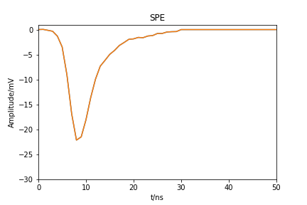

# PMT-waveform

Template for the final project of PMT-waveform in Physics Data course

## 大作业简介

PMT-waveform这个作业基于中微子比赛延伸而来，目的希望让同学们了解在实验物理中模拟数据的产生过程以及模拟对于实验物理的指导作用。

作业中的所有输入数据和真实数据并不相同，但是可以基本表述真实的物理过程。在探测中微子过程中用到的重要的仪器就是光电倍增管(PMT)，当中微子和探测介质液体闪烁体发生作用后，会有对应数量(和中微子能量相关)的光子释放出来。当光子入射到PMT表面后，PMT会将光子的信号转化为电压信号，并将电压信号放大。具体的物理过程可以参考《核辐射物理及探测学》。

作业中涉及的数据均是这些电压信号，而光子产生的电压信号对于单个PMT来说可以基本认为不变为单光电子响应h(t)，而不同时间入射的光子x(t)(是一系列的$\delta$函数$)产生的电压信号会叠加在一起，整个过程可以视作一个线性时不变的系统，那么最后的波形y(t)由下式给出
$y(t)=x(t)*h(t)$
其中*表示卷积。

同学的任务就是重复上述的物理过程，将输入的入射光子波形x(t)转化成最后的波形。

## 数据说明

所有的输入数据存放在`data/`文件夹下，因此请不要随意改动这个文件夹下的内容。

`SPE.h5`中存放着单光电子响应h(t)

`PE-info.h5`中存放着入射光子的时间信息，即里面只记录了对应$\delta$函数的位置。具体格式如下
| EventID | ChannelID | PETime | Weight |
|---------|-----------|--------|--------|
|    1    |     0     |   276  |    1   |
|    1    |     0     |   286  |    1   |
|    1    |     0     |   303  |    1   |
|    1    |     1     |   276  |    1   |
|    1    |     1     |   296  |    1   |
|    1    |     2     |   306  |    1   |
...
|    1    |     29    |   276  |    1   |
|    1    |     29    |   306  |    1   |
...
...
|    3    |     0     |   276  |    1   |
|    3    |     0     |   286  |    1   |
|    3    |     0     |   303  |    1   |
|    3    |     1     |   276  |    1   |
|    3    |     1     |   296  |    1   |
|    3    |     2     |   306  |    1   |
...
|    3    |     29    |   276  |    1   |
|    3    |     29    |   306  |    1   |

其中第一列是`EventID`记录事件数，第二列`ChannelID`记录通道数，每一个事件对应有30个通道(PMT)，因为实际探测过程中有30个PMT在工作，而每个PMT记录到的对应光子数实际上可能有多个。

比如对于第3个事件，第0个PMT上在276，286，303上有光子入射进来，那么你需要把这三个光子产生的响应叠加在一起，使用之前所说的卷积公式(实际上就是平移叠加)，你就能够产生对应的波形了。

对于实际物理问题通常会有噪声，此处我们假定基线存在的是高斯噪声，对应的高斯分布的$\sigma$已经写进了`noise-level.csv`.

因此最终的波形即为理想的波形和噪声的叠加。
## 作业要求

作业分成以下几个部分，同学按规定完成对应任务即可拿到相应分数

|  superimpose.py  | 30 |
|  task-A          | 10 |
|  noise-sample.py | 20 |
|  task-B          | 5  |
|  add-noise       | 20 |
|  task-C          | 10 |
|  实验报告         | 5  |

`superimpose.py`读取`SPE.H5`与`PE-info.h5`生成`ideal-waveform.h5`，同学们生成的文件中应该包含对应channel数目N的波形，写成一个大小为N*1029的矩阵，以dataset存入HDF5文件的根目录中。dataset的命名为`waveformIdeal`.

task-A需要大家在同一张图上画出两个图像(subplot)，第一张图为单光电子波形`SPE`，第二张图上绘制任意一个channel的波形。注意标注横纵坐标的标签，图的标题。图的文件名命名为`task-A.png`.

`noise-sample.py`读取`noise-level.csv`生成`noise.h5`，同学们生成的文件中应该包含对应channel数目N的波形，写成一个大小为N*1029的矩阵，以dataset存入HDF5文件的根目录中。dataset的命名为`Noise`.

task-B需要大家在同一张图上画出一个图像，图为任意一个channel的噪声波形。注意标注横纵坐标的标签，图的标题。图的文件名命名为`task-B.png`.

`add-noise.py`读取之前同学自己产生的数据`ideal-waveform.h5`和`noise.h5`生成`waveform.h5`，进行叠加处理后，以dataset存入HDF5文件的根目录中。dataset的命名为`waveformNoise`.

task-C需要大家在同一张图上画出两个图像(subplot)，选定某个channel，第一张图为无噪声波形，第二张图上绘制对应channel的有噪声波形。注意标注横纵坐标的标签，图的标题。图的文件名命名为`task-C.png`.

实验报告需要写你在解决问题中的
A.思路
B.遇到的困难或问题